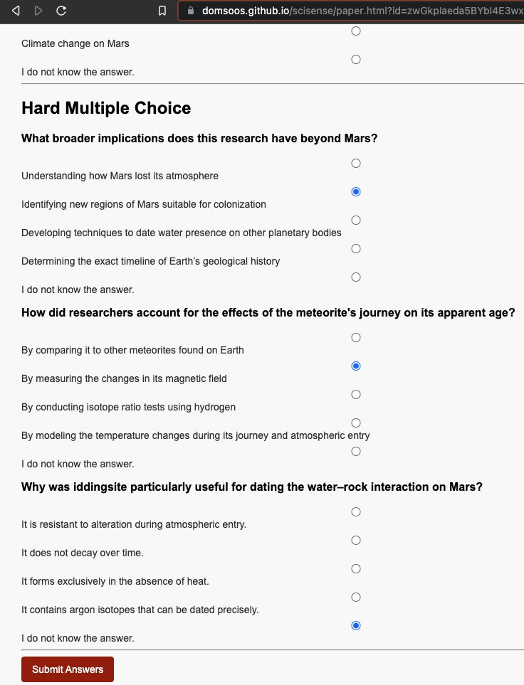
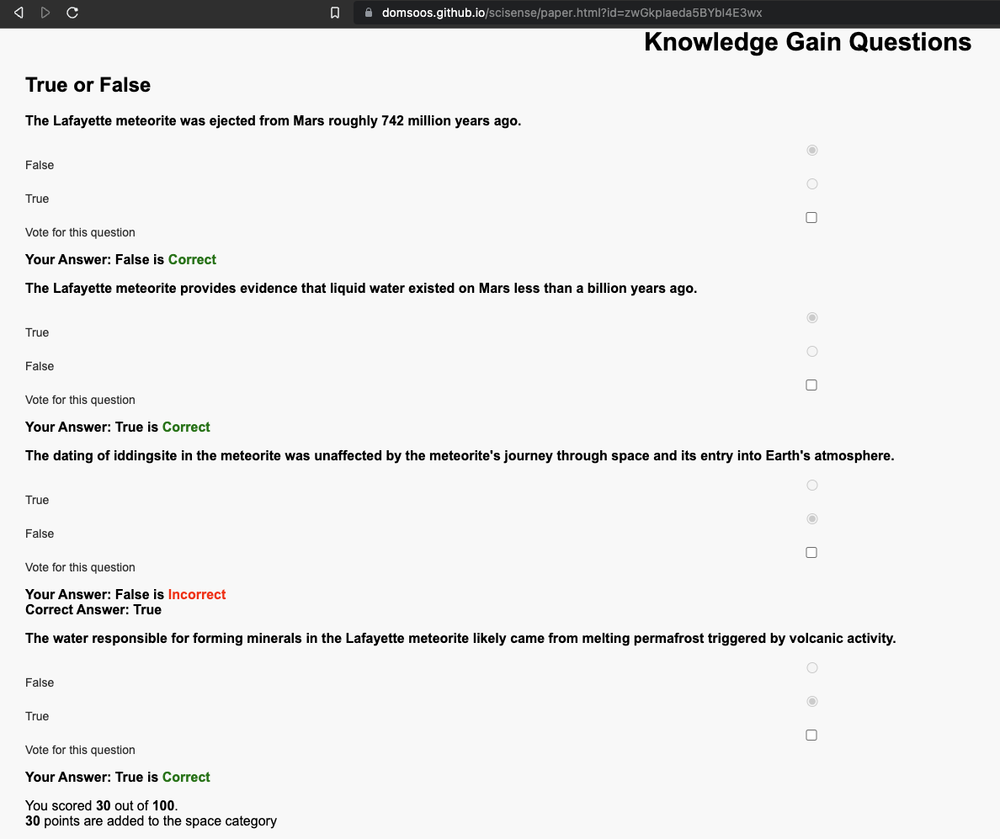
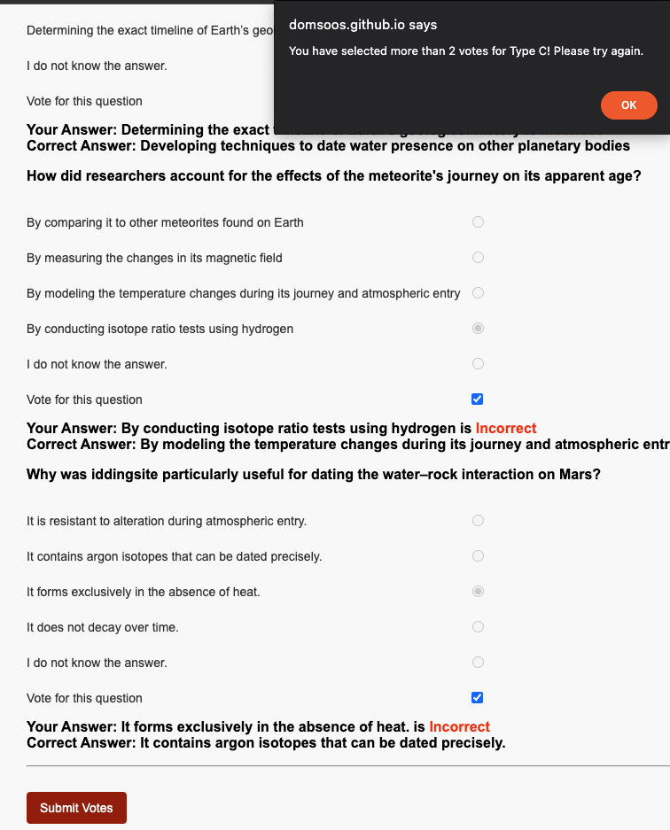

# Internal Voting Guidelines

## Objective 
The main goal is to identify reliable questions for each sample. There are a total of **10** samples, 10 candidate questions per sample. 

## Evaluation criteria
1. Abstract driven answers     
  The answers must be derivable directly from the abstract.
2. Unambiguity    
  Voters should feel comfortable with the questions and answers that they are clear and not ambiguous. 

## Procedure

goto [SciSense](https://domsoos.github.io/scisense/index.html)    
sign in if you have an account, otherwise create one.

For each discovery, complete Step 1 and 2:
### Step 1
- Read each science abstract and science news. 
- Answer each question

### Step 2
Voting for each category using the following instructions   

Vote for reliable questions **after reviewing the correct answers** to maintain an unbiased evaluation. For each sample, we have three types of questions:
- **True/False**   
Vote for **2 out of 4** candidate questions

- **Easy Multiple Choice**   
Vote for **2 out of 3** candidate questions

- **Hard Multiple Choice**   
Vote for **2 out of 3** candidate questions

### Note  
- If you vote for more than 6 questions, your votes will not be counted and have to redo the voting to submit. 
The system only allows 6 votes per sample, otherwise you'll get the following message: 

## Time Estimate

I will do it first and time it. 

